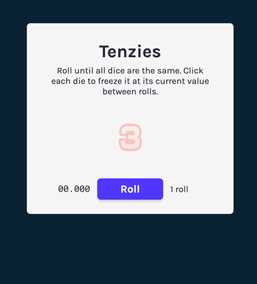

# Tenzies




This is the fourth module's project of Scrimba's [Learn React for free](https://scrimba.com/learn/learnreact) course.

[Figma design reference](https://www.figma.com/file/FqsxRUhAaXM4ezddQK0CdR/Tenzies)


## Features
- Timer
- Roll counter
- Save scores to localStorage
- Ranking of your best scores

---


## Run in development mode
```
npm start
```

## Build for production
```
npm run build
```

This project was bootstrapped with [Create React App](https://github.com/facebook/create-react-app)